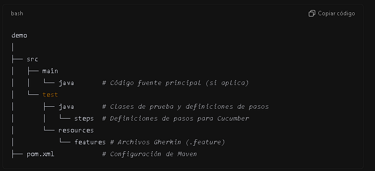
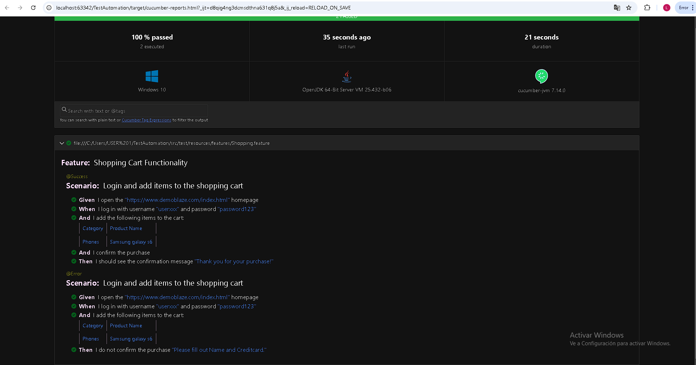

# TestAutomation
Documentación del Proyecto
1. Descripción
   Este proyecto está diseñado para realizar pruebas automatizadas utilizando:

Playwright: Para la automatización del navegador.
Cucumber: Para la escritura de pruebas en lenguaje Gherkin.
JUnit: Para ejecutar las pruebas.
2. Requisitos Previos
   Antes de instalar y ejecutar este proyecto, asegúrate de cumplir con los siguientes requisitos:

Software Requerido
Java Development Kit (JDK) 8 o superior

Descarga desde Oracle JDK o usa OpenJDK.
Verifica la instalación:
java -version
Apache Maven 3.6.0 o superior

Descarga desde Maven.
Verifica la instalación:
mvn -version
3. Instalación
   Paso 1: Clonar el Repositorio
   Clona el proyecto desde tu repositorio de Git (reemplaza <url-del-repositorio> con la URL de tu repositorio):

git clone <url-del-repositorio>
cd demo
Paso 2: Instalar las Dependencias
Ejecuta Maven para descargar las dependencias especificadas en el archivo pom.xml:

mvn clean install
Paso 3: Instalar los Navegadores para Playwright
Playwright requiere navegadores específicos para la automatización. Instálalos con:

npx playwright install

4. Estructura del Proyecto
   El proyecto sigue la estructura estándar de Maven:

5. Ejecución
   Ejecución de Pruebas Automatizadas
   Para ejecutar todas las pruebas configuradas:

mvn clean test
Para ejecutar pruebas específicas, edita el plugin maven-surefire-plugin en el archivo pom.xml para incluir las pruebas específicas.

Ver Resultados
Los resultados de las pruebas estarán disponibles en la consola.
Los reportes generados estarán en el directorio:
target/surefire-reports/

Video de la prueba
[03fa812ca3d0c82cb34a985e6e5a0b4b.webm](videos%2F03fa812ca3d0c82cb34a985e6e5a0b4b.webm)